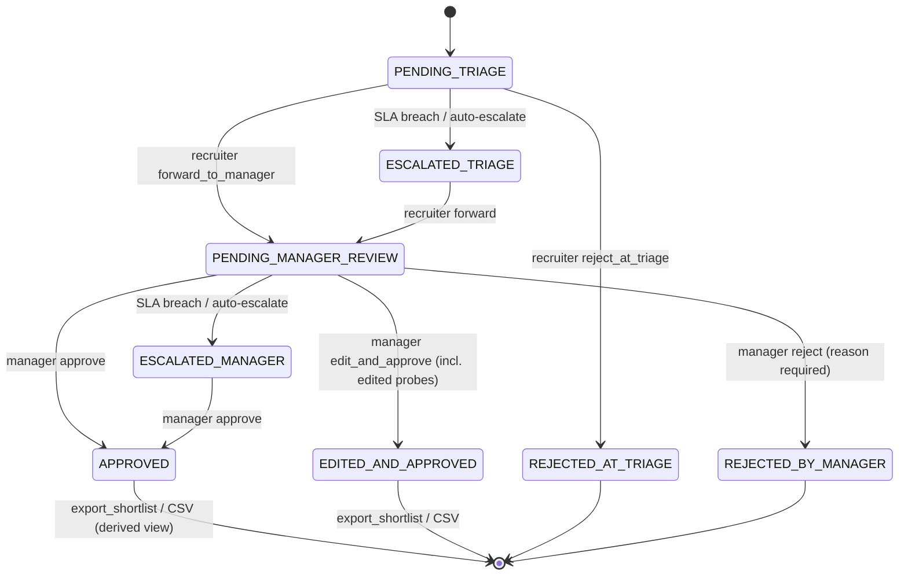

# Agentic Workflow — LangGraph Orchestration & Human Review Gate

> **Scope**: End-to-end execution of the multi-agent screening pipeline and its hand-off into the Candidate Review Task workflow.
> **Code**: `src/copilot/agents/orchestrator.py`, `src/copilot/application/use_cases/run_screening_pipeline.py`, `src/copilot/domain/review_task.py`.

---

## 1. Graph Overview

The orchestrator builds a **LangGraph state graph** (`StateGraph`) with typed, Pydantic-style state (`AgenticRAGState`). Every node is wrapped by a guard that enforces two resiliency controls:

| Control | Value | Enforced By |
|---|---|---|
| **Per-step timeout** | `30.0s` (`STEP_TIMEOUT_SECONDS`) | `asyncio.wait_for` inside `_guard_step` |
| **Max iterations** | `10` (`MAX_ITERATIONS`) | breaker checked before every step + passed as LangGraph `recursion_limit` |

```
recursion_limit = 10  ⇒ the graph engine refuses any run past 10 supersteps
```

When either control trips, an `OrchestratorError` is raised and the chat/pipeline entry point **degrades gracefully** to Plain RAG (`degraded: true`, `mode: "plain_rag"`).

---

## 2. Screening Pipeline Agent Sequence

`run_screening_pipeline` runs the four agents in a deterministic order and emits an `agent_event` for each as it completes:

```
evidence_extractor → bias_guard → rubric_scorer → interview_question_generator
```

```mermaid
sequenceDiagram
    autonumber
    participant O as Orchestrator (LangGraph)
    participant EE as evidence_extractor
    participant BG as bias_guard
    participant RS as rubric_scorer
    participant IQG as interview_question_generator
    participant RT as Candidate Review Task

    O->>EE: run_screening(state{candidate_id, job_id, rubric_id})
    EE-->>O: evidence = {quotes mapped to rubric criteria}

    O->>BG: redact(evidence)
    Note over BG: Deterministic regex — NO LLM
    BG-->>O: redacted evidence + audit log of redactions

    O->>RS: score(rubric, evidence)
    Note over RS: Numeric weights deterministic; LLM writes justification text only
    RS-->>O: rubric_scores = [0.0..1.0]

    O->>IQG: generate_interview_questions(candidate, job, scores)
    IQG-->>O: 3-5 tailored, evidence-grounded probes (JSON)

    O-->>RT: Create Review Task (PENDING_TRIAGE) with evidence, scores, probes
    RT-->>O: task_id
```

### Agent Isolation

| Agent | Concern | LLM? | Failure Mode |
|---|---|---|---|
| `evidence_extractor` | semantic retrieval + quote mapping to rubric criteria | Yes (synthesis of quotes) | missing evidence ⇒ review shows insufficient-evidence state |
| `bias_guard` | deterministic regex redaction of protected attributes + audit trail | **No** | redaction is context-independent; cannot fail from prompt injection |
| `rubric_scorer` | weighted numeric scoring; LLM writes justification only | Partial | malformed justification ⇒ score still computed deterministically |
| `interview_question_generator` | tailored evidence-grounded questions & probes from skill gaps + rubric | Yes (JSON array) | LLM disabled ⇒ deterministic 3-5 probe fallback |

---

## 3. State Transitions (Candidate Review Task)

Each screening result becomes a **Candidate Review Task** whose state machine flows through two human gates (T5):



Role enforcement: only `hr_recruiter` may run triage actions; only `hiring_manager` / `admin` may run decision actions; `admin` may `admin_override` at either stage with a mandatory reason.

### Approval Gate & Export
- On `APPROVED` / `EDITED_AND_APPROVED`, `decide_candidate.py` records the approved candidate (shortlist/export view).
- No `shortlist` record is created before the task reaches an approved status — the gate lives in the **use case**, not the router or UI.
- `GET /api/v1/shortlist/{job_id}/export?format=csv` derives the export purely from approved Candidate Review Tasks (Design Decision 5.5).

---

## 4. Dual Gemini Failover

The LLM is reached through a cascade that respects task-tier routing:

```
GeminiSdkAdapter  ──primary──►  success ⇒ return
        │
        ▼ (error / 429 / timeout)
FallbackLLMProvider (retry + backoff)
        │
        ▼
GeminiRestAdapter  ──fallback──►  success ⇒ return
        │
        ▼
deterministic stub / Plain-RAG degrade
```

- `GeminiSdkAdapter` (primary) and `GeminiRestAdapter` (fallback) both implement `LLMPort` (see [ADR-04](adr/ADR-04-gemini-only-provider-fallback.md)).
- `FallbackLLMProvider` cascades adapters with retry/backoff and selects the model tier (`FAST` vs `REASONING`).
- If all adapters fail, the workflow degrades to Plain RAG rather than erroring (NFR-04).

---

## 5. Degradation Path

| Trigger | Result |
|---|---|
| `SIMULATE_AGENT_FAILURE=true` | Orchestrator yields `{agent: "orchestrator", status: "degraded"}` and skips agent events |
| Per-step timeout > 30s | `OrchestratorError` → Plain RAG answer flagged `degraded: true` |
| Iteration count > 10 | `OrchestratorError` → Plain RAG answer flagged `degraded: true` |
| All Gemini adapters fail | Fallback stub / Plain RAG path with warning banner |

---

## 6. Related Documents

- [System Design](SYSTEM-DESIGN.md) — Design Decision 5.5 (Review Task UX) and Core Requirements Alignment
- [Architecture](ARCHITECTURE.md) — C4 diagrams & full sequence diagram
- [BRD](BRD.md) — BR-03 / BR-04 / BR-07 acceptance criteria
- [Security](SECURITY.md) — Excessive Agency row for the Review Task gate
- ADRs — [`ADR-02`](adr/ADR-02-pipeline-and-human-gate.md) (human gate), [`ADR-04`](adr/ADR-04-gemini-only-provider-fallback.md) (dual adapters)
