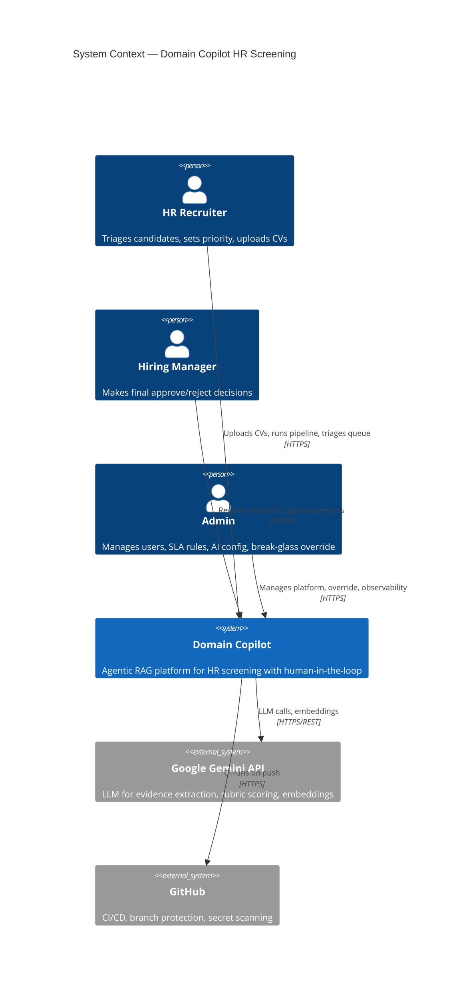
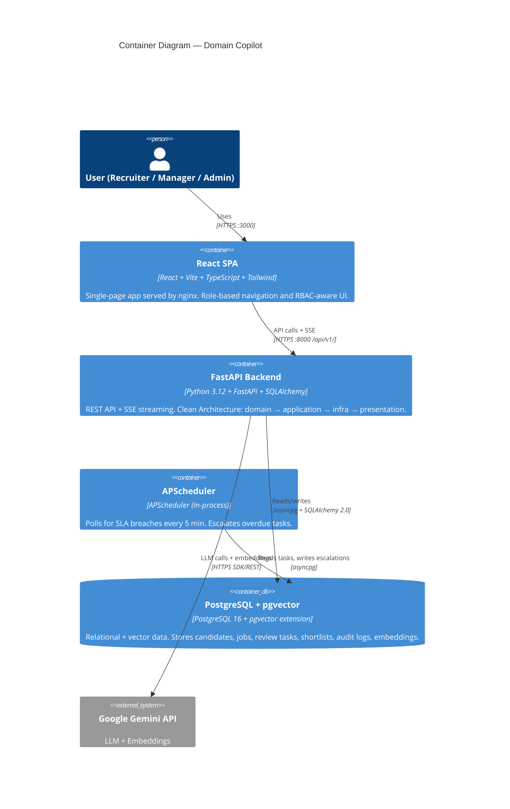
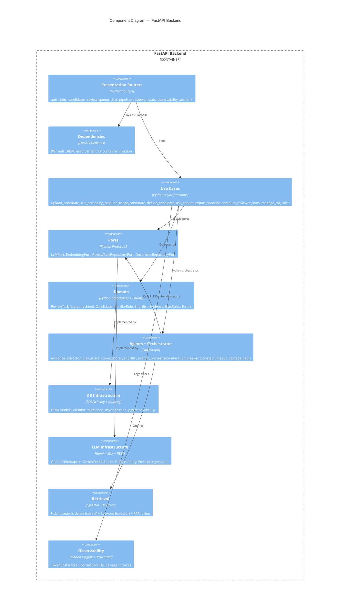
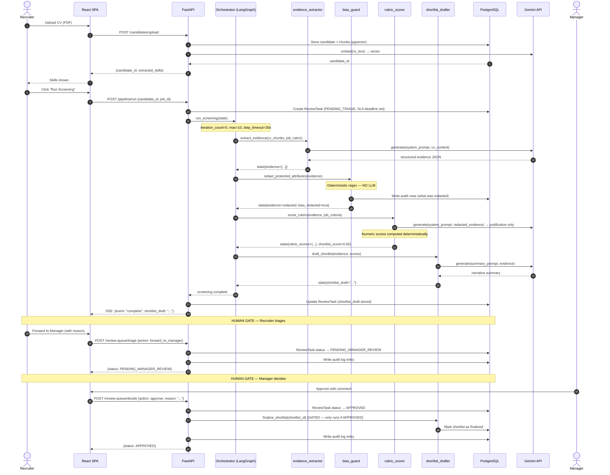
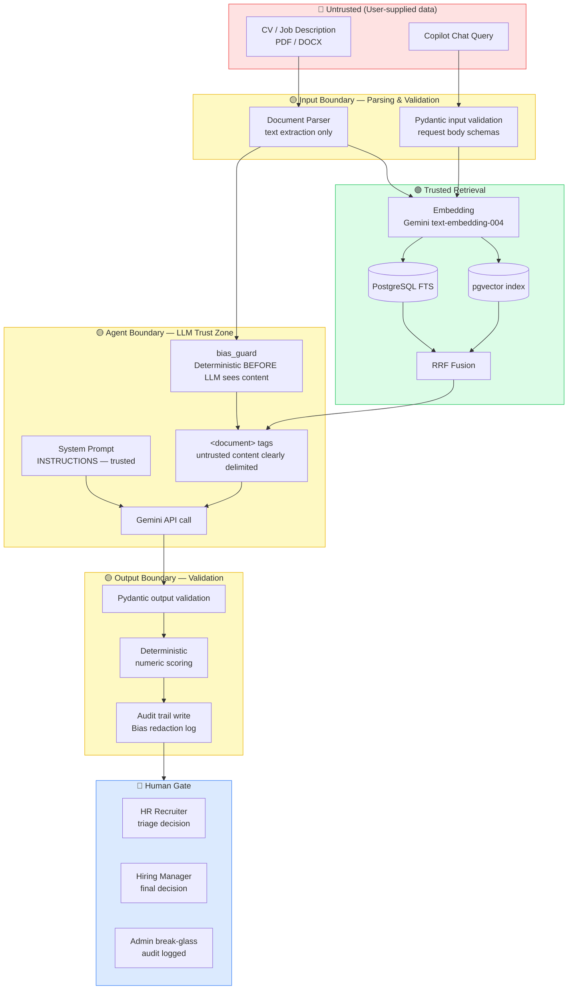
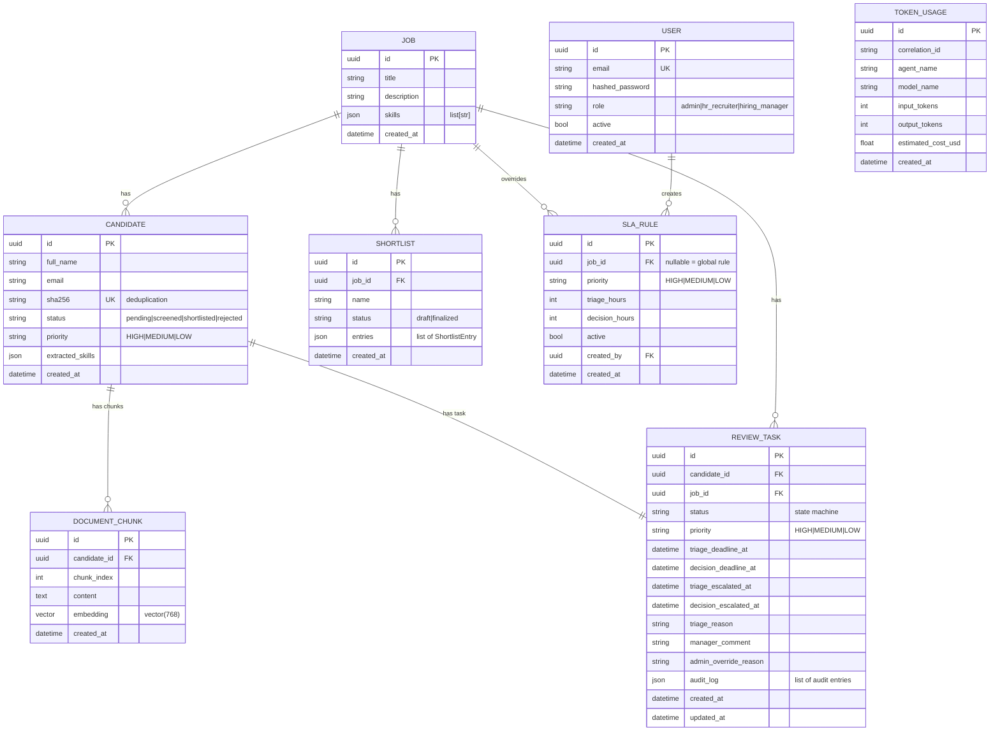
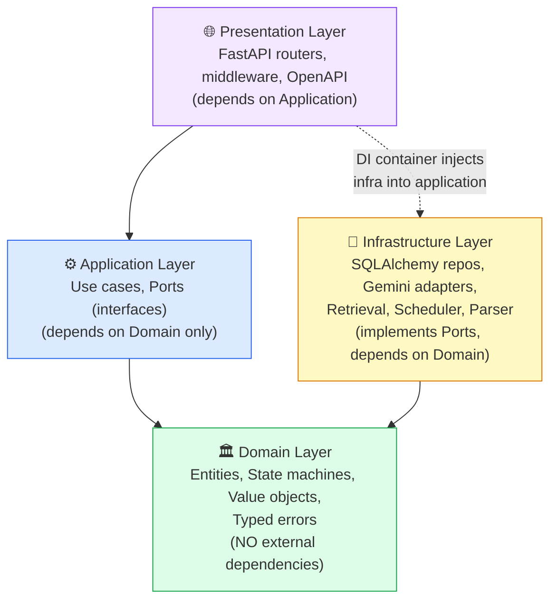

# Architecture Documentation

## C4 Level 1 — System Context

---

## C4 Level 2 — Container Diagram

---

## C4 Level 3 — Component Diagram (Backend)

---

## Sequence Diagram — Full Agentic Screening Workflow

---

## Data-Flow Diagram — Trust Boundaries

---

## ER Diagram

---

## Layer Dependency Diagram

---

## ADRs

See [`docs/adr/`](adr/) for all 4 Architecture Decision Records:

| ADR | Decision | Status |
|-----|----------|--------|
| [ADR-01](adr/ADR-01-chunking-strategy.md) | Paragraph-level chunks, 512 tokens, 50-token overlap | Accepted |
| [ADR-02](adr/ADR-02-pipeline-and-human-gate.md) | Human gate enforced at application layer, not agent layer | Accepted |
| [ADR-03](adr/ADR-03-two-stage-rbac-and-sla-rules.md) | Three roles (admin/recruiter/manager), two-level SLA resolution | Accepted |
| [ADR-04](adr/ADR-04-gemini-only-provider-fallback.md) | Two Gemini adapters (SDK + REST) as provider fallback | Accepted |
