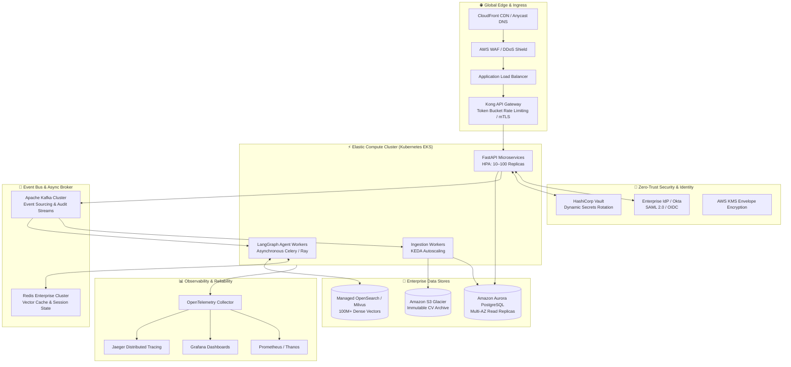
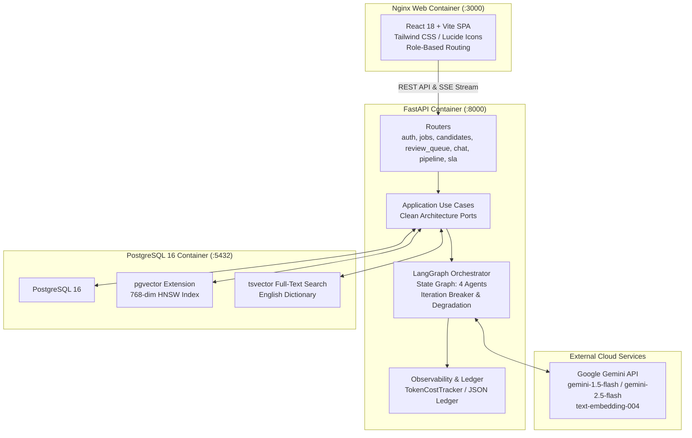

# System Design Document

> **System**: Domain Copilot for HR Screening (Variant D6 + T5)  
> **Author**: Nada Naguib | ITI Dev Instructor Task  
> **Target Version**: 1.0.0  
> **Status**: Approved & Implemented  
> **Repository**: [hr-screening-copilot](https://github.com/NadaNaguib/hr-screening-copilot)

---

## 1. Executive Summary & Architecture Philosophy

The **Domain Copilot for HR Screening** provides an automated, auditable, and human-governed talent screening pipeline. The system architecture adheres to two foundational principles:

1. **Clean Architecture Separation of Concerns**: The Domain layer contains all business entities, state machines, and evaluation rules without framework dependencies. The Application layer orchestrates use cases via abstract ports. The Infrastructure layer implements persistence, LLM connectivity, parsing, and scheduling. The Presentation layer handles HTTP and Server-Sent Events (SSE).
2. **Human-in-the-Loop Governance (T5)**: AI agents act strictly as assistive intelligence (extracting evidence, detecting bias, evaluating rubric criteria, and drafting summaries). All candidate progression, shortlist approvals, and rejections are governed by human review workflows backed by SLA timers, role-based approval stages, and audit trails.

---

## 2. Part A: Target Unconstrained Enterprise Architecture

In an unconstrained enterprise environment processing 500,000+ applicants annually across global recruitment teams, the target architecture scales horizontally across multiple availability zones with high availability, zero-trust security, and millisecond vector search.

### 2.1 Ingress, API Gateway & Rate Limiting
- **Global Edge**: CloudFront CDN terminates TLS 1.3, caches static frontend assets, and provides DDoS mitigation via AWS Shield Advanced.
- **API Gateway**: Enterprise Kong API Gateway handles JWT token introspection, mutual TLS (mTLS) for microservices, and token-bucket rate limiting (e.g., 500 requests/minute per recruiter; 5,000 requests/minute global ceiling).
- **Request Routing**: Intelligent routing distributes traffic across geographically distributed clusters with health-checked failover.

### 2.2 Identity, Secrets & Zero-Trust Security
- **Identity Provider (IdP)**: Corporate Okta / Azure AD integration via SAML 2.0 and OIDC, supporting Single Sign-On (SSO) and Multi-Factor Authentication (MFA).
- **Secrets Management**: HashiCorp Vault dynamically generates ephemeral database credentials with 1-hour TTLs. All API keys (Gemini, external services) are encrypted at rest using AWS KMS envelope encryption.
- **Data Encryption**: All data in transit uses TLS 1.3. S3 buckets and RDS volumes enforce AES-256 (AWS-KMS) encryption at rest.

### 2.3 Asynchronous Event Bus & Distributed Processing
- **Event Bus**: Apache Kafka manages asynchronous screening pipelines. Ingestion of resumes, OCR processing, and multi-agent evaluations run as distributed event streams.
- **Worker Scaling**: Kubernetes Event-Driven Autoscaling (KEDA) dynamically scales Celery/Ray worker pods based on Kafka queue backlog length, ensuring sudden surges (e.g., career fair uploads of 5,000 resumes) scale to 100+ workers within 90 seconds.

### 2.4 Multi-Tier Caching & Vector Storage
- **L1 / L2 Caching**: Redis Enterprise Cluster caches frequent embedding vectors, rubric templates, and active user sessions, reducing embedding API costs by up to 40%.
- **Dedicated Vector Search**: Distributed OpenSearch or Milvus cluster indexes 100M+ dense vectors with HNSW indices, guaranteeing sub-25ms approximate nearest neighbor (ANN) retrieval at 99.9th percentile.

### 2.5 Observability, Tracing & Cost Accounting
- **Distributed Tracing**: OpenTelemetry instrumentation propagates W3C `traceparent` headers across API gateways, worker queues, and LLM adapters into Jaeger.
- **Metrics & Alerting**: Prometheus scrapes latency, error rates, and queue depths. Grafana provides dashboards for p95/p99 latencies, reviewer SLA compliance, and LLM token expenditures.
- **Cost Accounting**: Every agent invocation logs token counts (prompt, completion) and financial cost in USD to an immutable audit lake for department-level chargeback.

### 2.6 Disaster Recovery & Business Continuity
- **RPO & RTO**: Recovery Point Objective (RPO) $\le 15\text{ minutes}$; Recovery Time Objective (RTO) $\le 60\text{ minutes}$.
- **Multi-Region Strategy**: Active-Passive multi-region deployment across `us-east-1` (primary) and `us-west-2` (secondary). S3 Cross-Region Replication (CRR) and Aurora Global Database replicate data continuously.
- **Backup Strategy**: Automated daily snapshots retained for 90 days; continuous PostgreSQL Write-Ahead Log (WAL) archiving to S3 with point-in-time recovery (PITR) up to 35 days.

### 2.7 3-Year Enterprise Financial Cost Model (500k Candidates / Year)

| Cost Category | Year 1 | Year 2 | Year 3 | 3-Year Total |
|---|---|---|---|---|
| **Elastic Cloud Compute (AWS EKS, ALB, NAT)** | $38,400 | $44,160 | $50,784 | **$133,344** |
| **Managed Databases (Aurora PG, Multi-AZ)** | $21,600 | $24,840 | $28,566 | **$75,006** |
| **Distributed Vector Store (OpenSearch/Milvus)** | $18,000 | $20,700 | $23,805 | **$62,505** |
| **Redis Enterprise & Kafka Managed Clusters** | $14,400 | $16,560 | $19,044 | **$50,004** |
| **LLM Token Costs (Gemini 1.5 Flash + Embeddings)** | $22,500 | $25,875 | $29,756 | **$78,131** |
| **Zero-Trust Security (Vault, WAF, KMS)** | $9,600 | $11,040 | $12,696 | **$33,336** |
| **S3 Storage & Data Transfer** | $4,800 | $5,520 | $6,348 | **$16,668** |
| **Observability (Datadog / Managed Grafana)** | $12,000 | $13,800 | $15,870 | **$41,670** |
| **Total Enterprise Infrastructure** | **$141,300** | **$162,495** | **$186,869** | **$490,664** |

---

## 3. Part B: MVP Implementation & Architecture

The MVP implements the complete functional domain specifications of **Variant D6** and **T5** while packaging the system into a lean, highly maintainable single-command Docker deployment.

### 3.1 LangGraph Multi-Agent Architecture
The screening pipeline executes four specialized agents in a deterministic sequence:
1. **`evidence_extractor`**: Performs semantic search across candidate chunks, extracting direct quotes mapped to rubric criteria.
2. **`bias_guard`**: A non-LLM, deterministic regex engine that scans extracted evidence for protected attributes (gender, ethnicity, age, religion, marital status), redacting them and writing an audit trail.
3. **`rubric_scorer`**: Computes deterministic weighted numeric scores ($[0.0, 1.0]$) while delegating qualitative justification text generation to the LLM.
4. **`shortlist_drafter`**: Compiles an executive summary and candidate assessment for hiring manager review.

### 3.2 Resilience & Degradation
- **Iteration Breaker**: The LangGraph state machine enforces a maximum of 10 iterations to prevent infinite agent execution loops.
- **Per-Step Timeout**: Each agent step is wrapped in a 30-second asyncio timeout.
- **Plain RAG Fallback**: If LLM provider errors (e.g., HTTP 429 rate limits, network timeouts) occur, the orchestrator automatically activates its degradation path (`degraded=true`), falling back to dense/sparse retrieval and deterministic synthesis.

---

## 4. Gap Analysis Table (Enterprise Target vs. MVP Implementation)

| Component / Feature | Enterprise Target Spec | MVP Implementation | Why Deferred | Interim Mitigation | Effort & Cost to Close Gap |
|---|---|---|---|---|---|
| **API Gateway & Ingress** | Kong Enterprise Gateway with token-bucket rate limiting, mTLS, and WAF rules. | Nginx reverse proxy with CORS headers and FastAPI route handlers. | Minimizes operational overhead and container footprint for initial developer deployment. | FastAPI application-level rate limiting middleware and reverse proxy buffering. | 3 engineer-weeks; ~$1,500/month Kong Enterprise licensing. |
| **Identity & Access Management** | Okta / Azure AD SSO via SAML 2.0 and OIDC with enterprise directory sync. | JWT access tokens with bcrypt password hashing and role-based database permissions. | Enterprise directory federation requires tenant-specific IdP setup. | Secure stateless JWT authentication with role claims and password complexity rules. | 2 engineer-weeks; ~$3/user/month Okta Workforce Identity. |
| **Secrets Management** | HashiCorp Vault cluster with automated dynamic credential rotation and KMS envelope encryption. | Container environment variables passed via `.env` file and Docker Compose. | Production Vault cluster adds cluster bootstrapping complexity. | Strict file permissions on `.env`, zero secrets committed to Git, gitleaks CI scanner. | 1 engineer-week; ~$500/month managed Vault or AWS Secrets Manager. |
| **Event Bus & Asynchronous Queues** | Apache Kafka cluster with multiple partitions and consumer groups for event-driven screening. | In-memory asyncio background tasks and APScheduler in FastAPI container. | Eliminates ZooKeeper/Kafka broker operational complexity in local environment. | FastAPI `BackgroundTasks` with transactional database status updates. | 4 engineer-weeks; ~$1,200/month Amazon MSK cluster. |
| **Compute & Autoscaling** | Kubernetes (EKS) with KEDA scaling worker pods from 10 to 100+ replicas based on queue lag. | Multi-container Docker Compose running on a single host server. | Single-host architecture simplifies evaluation and local deployment. | Optimized multi-threaded asyncio event loop with connection pooling. | 3 engineer-weeks; ~$3,200/month EKS compute and management fees. |
| **Multi-Tier Caching** | Distributed Redis Enterprise cluster for query embeddings, session states, and rubric criteria. | Application-level in-memory caching and direct PostgreSQL relational caching. | Reduces infrastructure footprint for single-instance demo. | Fast PostgreSQL indexed lookups and local in-memory dictionaries. | 1 engineer-week; ~$600/month managed AWS ElastiCache Redis. |
| **Vector Storage & Search** | Dedicated OpenSearch or Milvus cluster indexing 100M+ vectors with distributed sharding. | PostgreSQL `pgvector` extension running on PostgreSQL 16 with HNSW index. | PostgreSQL + pgvector unifies relational and vector data in a single transactional store. | Hybrid search combining pgvector dense cosine search with tsvector full-text search via RRF. | 3 engineer-weeks; ~$1,500/month Amazon OpenSearch Service. |
| **Observability & Tracing** | OpenTelemetry Collector exporting metrics, logs, and traces to Datadog / Prometheus / Grafana / Jaeger. | Structured Python logging, persistent JSON token ledger, and dynamic AI Control Panel. | Centralized APM clusters require external SaaS licenses or large collector daemons. | Disk-persisted `/tmp/token_ledger.json`, live web diagnostic cards, and request correlation IDs. | 2 engineer-weeks; ~$1,000/month Datadog APM & logging. |
| **Disaster Recovery** | Multi-region Active-Passive deployment with automated failover, RPO $\le 15\text{m}$, RTO $\le 60\text{m}$. | Single-instance persistent Docker volumes mounted from host filesystem. | Multi-region cloud topology requires multi-cloud account provisioning. | Automated PostgreSQL `pg_dump` volume backup scripts and git-backed code state. | 2 engineer-weeks; ~$2,000/month secondary standby infrastructure. |

---

## 5. Design Decisions: Alternatives Considered & Rejected

### 5.1 Storage: PostgreSQL + pgvector vs. Standalone Vector DB (Pinecone / Milvus)
- **Decision**: Adopt PostgreSQL 16 with `pgvector` for both relational metadata and document chunk embeddings.
- **Alternatives Considered**: Pinecone (cloud-managed), Milvus, Qdrant.
- **Rationale for Rejection**:
  - Standalone vector databases introduce distributed two-phase commit problems: candidate profiles live in one database while vector embeddings live in another, risking synchronization drift upon candidate deletion or updates.
  - `pgvector` provides ACID transactional guarantees. Deleting a candidate or job vacancy atomically cascades to delete all associated document chunks and vector embeddings in a single database transaction.
  - Combines relational SQL filtering (`job_id`, `status`) and vector similarity search in a single execution plan, eliminating round-trip latency.

### 5.2 Orchestration: LangGraph vs. AutoGen vs. LangChain AgentExecutor
- **Decision**: Implement the screening pipeline using **LangGraph** with a custom Pydantic-typed state graph.
- **Alternatives Considered**: Microsoft AutoGen, LangChain `AgentExecutor`, custom procedural scripts.
- **Rationale for Rejection**:
  - `AgentExecutor` is black-box and deprecated; it offers insufficient control over deterministic intermediate steps like bias redaction.
  - AutoGen conversational multi-agent systems exhibit non-deterministic conversation termination, leading to excessive token consumption and unpredictable execution paths.
  - LangGraph provides cyclic graph support with strictly typed state transitions, enabling exact enforcement of our iteration breaker ($\le 10$ steps), per-step timeouts, and programmatic degrade-to-Plain-RAG paths.

### 5.3 Backend Framework: FastAPI (Python 3.12) vs. NestJS (Node.js) vs. Go (Fiber)
- **Decision**: Build the presentation and application layers with **FastAPI** on Python 3.12.
- **Alternatives Considered**: NestJS / TypeScript, Go / Gin / Fiber.
- **Rationale for Rejection**:
  - Node.js and Go lack native, mature libraries for high-performance scientific NLP document parsing (`pypdf`, `pdfplumber`, `python-docx`) and direct integration with Python-native agentic frameworks (LangGraph, NumPy).
  - FastAPI provides native asynchronous ASGI support, automatic OpenAPI/Swagger documentation generation, and strict runtime type validation via Pydantic v2.

### 5.4 Bias Mitigation: Deterministic Regex Redaction vs. LLM Self-Correction Prompt
- **Decision**: Enforce **deterministic regex-based redaction** of protected attributes prior to LLM rubric scoring.
- **Alternatives Considered**: Instructing the LLM via system prompt ("Do not consider candidate gender or age").
- **Rationale for Rejection**:
  - LLM self-correction via system prompts is vulnerable to indirect prompt injection and stochastic compliance failures.
  - Regulatory compliance (EU AI Act, EEOC guidelines) requires an auditable, provable guarantee that protected attributes were not present in the scoring context.
  - Deterministic pre-processing guarantees 100% attribute exclusion and produces a verifiable audit log for compliance inspection.
